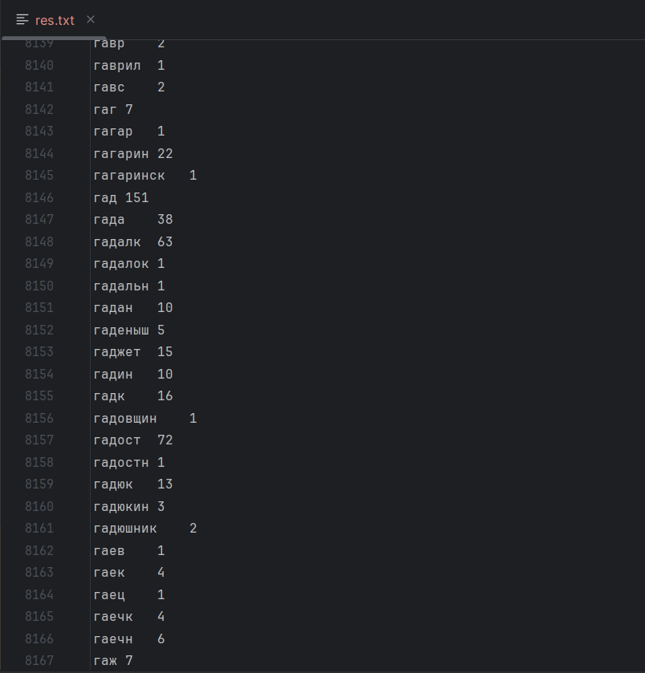

# Шамаев Онар Евгеньевич | БПИ227 ФКН ПИ 3 Курс | Распределенные вычисления ДЗ-1

## Требования к выполнению
Для выполнения нам потребуется установленная система котейнеризации `Podman` и
JDK-1.8.
В добавок для обработки результата будем использовать `python3`.

_Работа выполянялась через WSL на ОС Windows 10. Через Intellij IDEA._

## План работы
1. Подготовим кластер HDFS
2. Соберем исполняемую программу MapReduce
3. Выполним программу
4. Посмотрим на результаты
5. P.S.

## Ход работы
### 1. Подготовим кластер HDFS

В репозитории в папке `compose` располагаются все файлы связанные с
развертыванием кластера и обработки его результата.

Файл `compose/docker-compose.yml` определяет: как будут разворачиваться hadoop
контейнеры, связывание контейнеров в сеть для системы контейнеризации podman.
Для быстрого запуска этой конфигурации определен скрипт `compose/pdmn-start.sh`.

Находясь в директории `compose` выполним команду: `./pdmn-start up -d`.

Выполним команду: `podman ps`.

Видим, что 3 контейнера: 1 namenode и 2 datanode - поднялись.
_Если что-то пошло не так и кластер не поднимается или возникают проблемы,
то следует удалять папку `compose/hdfs` (в нее маунтятся хранилища
datanode и namenode, и могут возникнуть ошибки при пере-поднятии контейнеров)._

Web-UI namenode доступен по адресу `http://localhost:9870/`. Откроем в браузере,
чтобы увидеть состояние работающего кластера.

Видно что кластер успешно создался (так как обе datanode расположены на одном
устройстве, то класер считает что доступно ~4ТБ, хотя на деле всего ~2ТБ).

### 2. Соберем исполняемую программу MapReduce

Входными данными будет датасет из 120'000 анекдотов на русском (в том числе с
ненормативной лексикой: ПРОСМАТРИВАЙТЕ НА СВОЙ СТРАХ И РИСК). Задачей будет узнать,
какие слова используются чаще всего в анекдотах. Чтобы хоть как-то обобщить смысл слова,
будем использовать стемминг (обрезание до значимой смысловой части).
Датасет расположен в архиве `compose/upload_txt/anek_utf8.zip`, его необходимо
предварительно там распаковать и  оставить файл `compose/upload_txt/anek_utf8.txt`

Данный проект является проектом на Kotlin (Java), и основная MapReduce программа
расположена в `src/main/kotlin/Main.kt`.

Данная программа определяет Job, который на входе обрабатывает
многострочный файл датасета анекдотов, а на выходе выдает количество
прошедших через стемминг слов.

Находясь в директории проекта соберем исполняемый jar файл программы
командой `.gradlew jar` (если путь до JDK указан в системной переменной JAVA_HOME),
либо через задачу gradle jar в Intellij Idea:

Собранный jar файл получим по пути `build/lib/HDFS-1.0-SNAPSHOT.jar`:

Перенесем файл в папку `compose/upload_jar`:

### 3. Выполним программу

Загрузим наш датасет в HDFS:

Из каталога `compose/upload_txt` выполним скрипт `./pdmn-upload.sh`:

Данный скрипт загружает внутрь namenode контейнера файл датасета.

Из каталога `compose/upload_jar` выполним скрипт `./pdmn-exec.sh /out`:

Данный скрипт запускает на namenode нашу jar программу с выводом результата в папку out.

### 4. Посмотрим на результаты

Из каталога `compose/retrieve` выполним скрипт `./pdmn-result.sh /out/part-r-00000 > res.txt`:

Данный скрипт выводит содержание файла /out/part-r-00000 из HDFS и сохраняет в файл res.txt

Вот некоторое содержание:

Чтобы, наконец узнать ответ на вопрос выполним скрипт `./top.sh res.txt`:

Однако очевидно, что частиц, союзов и местоимений будет всегда много, поэтому посмотирим
на слова по минимальной длине 4. Выполним скрипт `./top.sh res.txt 4`:

### 5. P.S.

Чтобы снести с компьютера развернувшийся кластер HDFS
необходимо выполнить команду `podman stop -a && podman rm -a`.

Также следует удалить папку `compose/hdfs`.